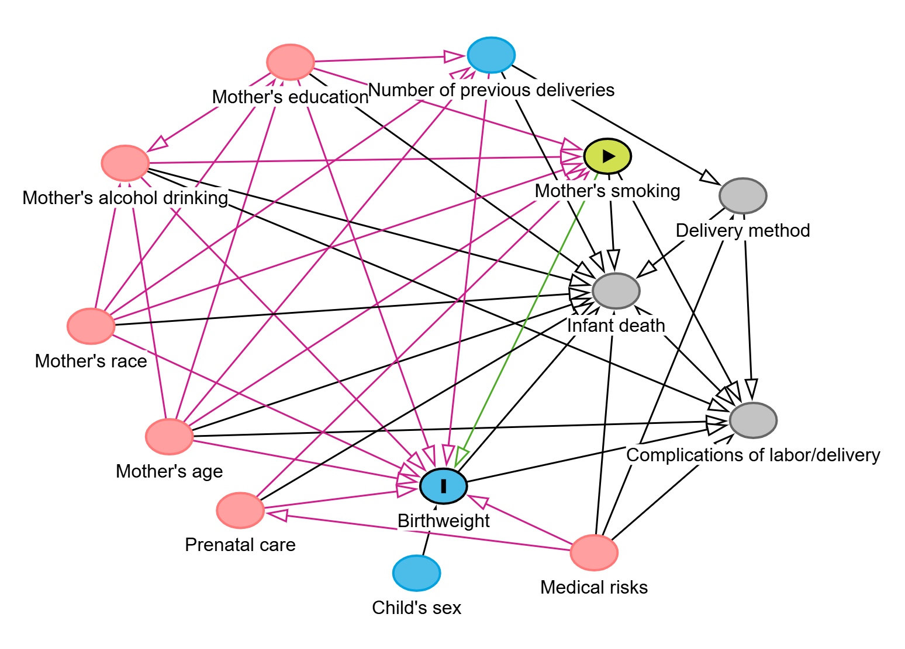
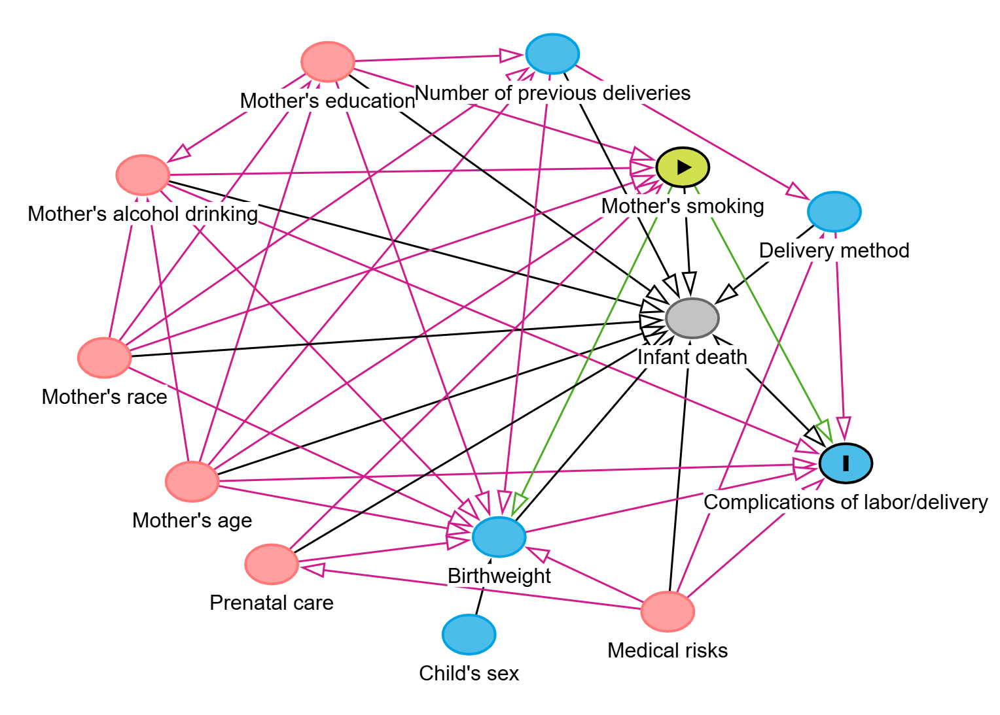

```{r setup, include=FALSE}
knitr::opts_chunk$set(echo = TRUE, message = FALSE, warning = FALSE)
```

```{r}
library(readxl)
library(tidyverse)
library(gtsummary)
library(ggplot2)
library(patchwork)
library(flextable)
library(ggResidpanel)
library(ggfortify)
library(GGally)
library(lmtest)
library(sandwich)
library(corrplot)
library(car)
library(emmeans)
```

```{r}
#чтение основных данных
data <- read_excel("data/raw/HW_data.xlsx")
dictionary <- read_excel("data/raw/HW_dictionary.xlsx")
```

```{r}
#преобразование категориальных переменных в фактор и переименование подуровней
data <- data %>% 
  mutate(
    # across(c(mrace3, dmar, dmeduc3, dtotord, dlivord, medrisk, tobacco, alcohol, pldel, delmeth, csex, labor, newborn, congenit, death,  adequacy), as.factor,
         across(c(medrisk, labor), ~factor(., levels = c("0", "1"), labels = c("Нет", "Да"))),
         tobacco = factor(tobacco, levels = c("0", "1"), labels = c('0' = 'Некурящие', '1' = 'Курящие')),
         mrace3 = factor(mrace3, levels = c('White', 'Black', 'Other'), labels = c("Европеоидная", "Афроамериканка", 'Другая')),
         dmeduc3 = factor(dmeduc3, levels = c('Elementary school', 'High school', 'Colledge'), labels = c("Начальная школа", "Старшая школа", 'Колледж/высшее')),
         adequacy = factor(adequacy, levels = c('Adequate', 'Intermediate', 'Inadequate'), labels = c("Адекватный", "Средний", 'Неадекватный')),
         csex = factor(csex, levels = c("Male", "Female"), labels = c("Мальчик", "Девочка")),
         
         cigar_col = case_when(cigar == 0 ~ NA,
                               TRUE ~ cigar) )

```

```{r}
#Создание темы графиков для документа
thememine <- theme(
  plot.title = element_text(size = 15, hjust = 0.5),
  plot.subtitle = element_text(size = 16, hjust = 0.5),
  axis.title = element_text(size = 12),
  axis.text = element_text(size = 9, colour = 'grey10'),
  panel.background = element_rect(fill = 'white'),
  panel.grid = element_line(colour = 'grey90')
)

theme_set(thememine)
```

```{r}
#создание основных цветов для графиков
tobaccovalues <- c('Некурящие' = 'lightcyan3', 'Курящие' = 'aquamarine3')
```

```{r}
#функция переименования переменных
varnames <- function(x) {
  case_when(x == 'dmage' ~ 'Возраст матери, лет',
            x == 'dbirwt' ~ 'Вес ребенка при рождении, г',
            x == 'dtotord' ~ 'Номер родов',
            x == 'dmeduc' ~ 'Образование матери, лет',
            x == 'monpre' ~ 'Месяц начала пренатального ухода',
            x == 'nprevist' ~ 'Общее число пренатальных визитов',
            x == 'gestat' ~ 'Гестационный период, недели',
            x == 'cigar' ~ 'Среднее число употребляемых в день сигарет',
            x == 'drink' ~ 'Среднее число употребляемых в день алкогольных напитков',
            TRUE ~ x )
}
```

<br>


# **Постановка задачи**

Курение является модифицируемым фактором риска неблагоприятных исходов для матери и новорожденного [1,2]. Согласно систематическому обзору и метаанализу, опубликованному в 2018 году, распространенность курения во время беременности оценивается в 1,7% в мире, варьируясь от 0,8% в Африке до 8,1% в Европе [3]. 

Исходя из литературных данных, курение матери во время беременности статистически значимо связано с риском низкой массы тела при рождении [3] и повышением рисков шести подтипов врожденных аномалий развития даже при употреблении всего 1–5 сигарет в день [4]. Согласно некотрым данным, курение сигарет во время беременности увеличивает позднюю внутриутробную и неонатальную смертность на 28% и снижает вес при рождении на 170 г, при этом данные различия сохраняются даже после учета ряда «опосредующих» материнских и социальных факторов [5].

Основная причина таких осложнений беременности из-за курения, скорее всего, связана с сочетанием воздействия токсинов, гипоксии, окислительного стресса и эпигенетических изменений [6].

Хотя вред курения во время беременности широко известен, цель этого исследования — не просто подтвердить его наличие, а точно оценить величину этого эффекта в определенной популяции. Это может быть полезно для информирования беременных женщин и их семей с использованием конкретных цифр.

Задачами работы являлось изучение общего эффекта курения матери во время беременности, проявляющееся в двух вариантах исхода: 
- количественный - изменение среднего значения веса ребенка при рождении;
- бинарный - изменение вероятности развития осложнений во время родов и/или родоразрешения.

Для понимания причинно-следственного влияния курения на исходы беременности недостаточно использовать стандартные методы, предсказывающие исход на основе данных и не учитывающих вклад определенных внешних факторов. Поэтому в основе анализа, представленного в этой работе лежит каузальная модель, построенная на основе направленного ациклического графа, позволяющая четко задать роль каждой переменной (конфаундеров, медиаторов и коллайдеров) и на основе этого оценить чистое влиняния курения на выбранные исходы беременности.

Таким образом полученные в данной работе результаты следует интерпретировать как эффект активного курения матери во время беременности в рамках установленных причинно-следственных связей учтенных переменных, с пониманием возможного смещения оценки.

В нашем исследовании мы ожидаем наличие аналогичных описанным эффектам результатов относительно нашей популяции N, т.е. снижение среднего веса ребенка при рождении и повышения вероятности развития осложнений во время родов у курящих пациенток.

...

<br>

# **Материалы и методы**

Все представленные в работе расчеты и визуализацию проводили в RStudio (версия 2025.05.1 Build 513) c использованием языка R (версия 4.5.1). 

Для индентификации конфаундеров и отбора минимального количества ковариат для моделей использовали направленный ациклический граф (direct acyclic graph, DAG), включающий следующие переменные: курение матери во время беременности, вес ребенка при рождении, возраст матери, раса матери, употребление алкогольных напитков матерью, образование матери, пренатальный уход, медицинские риски, пол ребенка, количество предыдущих родов, смерть ребенка, осложнения при родах, метод родоразрешения. 

Визуализацию и анализ полученного DAG проводили с помощью онлайн-приложения DAGitty (версии 3.1). 

Графическую визуализацию переменных проводили с использованием функций пакета ggplot2 (версии 4.0.1) и patchwork (версии 1.3.2) если не указано иное.

Табличное представление результатов проводили с использованием функций пакета flextable (версии 0.9.10) если не указано иное.

...

<br>

## **Дизайн исследования**

Данное исследование представляет собой кросс-секционное (поперечное) исследование, основанное на анализе собранных данных о беременности и родах. Исследование включает информацию о 537 женщин популяции N, данные о которых были получены из медицинской документации и опросников за 2023-2025 гг. 

Исследование одобрено локальным этическим коммитетом. Все участницы предоставили добровольное информированное согласие на использование их обезличенных данных.

...

<br>

## **Конечные точки**

В качестве конечных точек используется две переменные:

1) непрерывная количественная - вес ребенка при рождении в граммах;
2) бинарная переменная - наличие любого осложнений при родах/родоразрешении (произошли/ не произошли осложнения).
...

<br>

## **Описательные статистики**

В качестве описательных статистик категориальных переменных использовали абсолютные (n) и относительные (%) частоты. Расчет и табличное представление показателей выполняли с помощью функций tbl_summary, add_overall и as_flex_table пакета gtsummary (версия 2.4.0). Визуализацию категориальных переменных осуществляли с помощью стобчатых диаграмм.

В качестве описательных статистик количественных переменных использовали среднее, медиану, стандартное отклонение, 1 и 3 квартили, минимальное и максимальное значения. Значение среднего, а также максимальное и минимальное значения рассчитывали с помощью базовых функций R (mean, max и min соответственно), значения остальных показателей - с использованием функций meadian, sd, quantile пакета stats (версии 4.5.1). Распредление количественных переменных визуализировали с помощью гистограмм, боксплотов и графиков плотности.

...

<br>

## **Анализ конечной точки 1 модели**

### **Описание модели**

Связь между статусом курением матери во время беременности и весом ребенка при рождении оценивали с помощью линейной регрессии, построенной методом наименьших квадратов. Для разделения причинного эффекта и ложных ассоциаций использовали два типа моделей: однофакторную для оценки грубого эффекта и многофакторную с включением отобранных на основе DAG ковариат для оценки чистого эффекта. 

При возможном нарушении допущений модели (гетероскедастичности и ненормальном распределении остатков) использовали робастные стандартные ошибки по Хубера-Уайта типа HC3.

Линейную модель строили с помощью функции lm пакета stats (версии 4.5.1).

Коррекцию стандартных ошибок проводили с помощью функции coeftest пакета lmtest (версии 0.9-40) или с помощью функции emmeans и contrast пакета emmeans (версии 1.11.2-8) и функции vcovHC() с аргументом type = "HC3" пакета sandwiсh (версии 3.1-1).

...

<br>

### **DAG и отбор ковариат модели**

На рисунке 1 Представлен DAG, визуализирующий причинно-следственные связи между курением матери и весом ребенка при рождении. В таблице 1 систематезированы роли рассмотренных переменных, согласно DAG. 

{width=70%}


```{r}
DAG1 <- readxl::read_excel("DAG1.xlsx")

DAG1 %>% 
  select(c(2,3,5)) %>% 
  flextable() %>% 
  theme_box() %>% 
  bg(part = "header", bg = "moccasin") %>% 
  align(part = 'header', align = 'center') %>%
  align(j = c(2,3), align = 'center') %>%
  set_table_properties(layout = 'autofit', width = 0.8) %>% 
  set_caption('Таблица 1  - Роль переменных во взаимодействии курения матери и веса ребенка при рождении')
```


Для оценки чистого причинного эффекта в модели приняли решение проводить коррекцию на переменные, создающие нежелательные back-door пути между воздейтсвием и исходом, т.е. влияющие напрямую и через другие переменные конфаундеры. Для возможного снижения стандарных ошибок модели [7] учитывали также переменную предиктора исхода, т.е. нейтральную преременную, влияющую на исход.

Таким образом предложили следущий набор ковариат для статистической модели: употребление матерью алкогольных напитков, возраст матери, медицинские риски, пренатальный уход, раса матери, образование матери, пол ребенка.

...

<br>

### **Измерение ключевых показателей:**

Способы измерения показателей, включенных в модель, представлены в таблице 2.

Для изменерия показателя курения во время беременности не использовали количественную пременную в силу бОльшего информационного смешения относительно среднего числа выкуриваемых в день сигарет. Также эффект курения, исходя из наших предположений, имеет нелинейный характер относительно числа выкуриваемых сигарет (увеличени числа сигрет на 1 от 1 или 30 исходных изменяет эффект иначе). Категоризовать премернную исходя из числа выкуриваемых сигарет также сложно в силу небольшой распространенности курения среди беременных и недостаточно большого объема выборки.

Вес ребенка при рождении измеряли как количественную переменную с целью определения более точных эффектов воздействия.

Медицинские риски, расу матери и её образование измеряли как категориальные пременные с обобщенными группами для избежания излишней категоризации и множественного дробления небольшой выборки. 

Качество пренатального ухода сложно оценить в качестве количественной пременной, поэтому использовали общепринятый станадарт в виде критерия Kessner, позволяющего стандартизировать оценку и сравниваемые группы.

Также с целью оценки больее точных эффектов воздействий измерели как количественные переменные оставшиеся показатели.

```{r}
Model1variables <- readxl::read_excel("Model1variables.xlsx")

Model1variables %>% 
  flextable() %>% 
  theme_box() %>% 
  bg(part = "header", bg = "moccasin") %>% 
  align(part = 'header', align = 'center') %>% 
  set_table_properties(layout = 'autofit', width = 0.8) %>% 
  set_caption('Таблица 2 - Способы измерения основных показателей')
```

<br>

Диагностику линейности построеных моделей проводили визуально с использованием следующих графков: 

1) Fitted versus residuals для оценки линейности связи и постоянства разброса остатков; 

2) Scale-location для оценки гомоскедастичности остатков;

3) Residuals vs Leverage для оценки наличия влиятельных наблюдений; 

4) QQ-plot для оценки соответствия распределения остатков нормальному закону.

При этом, отклонение от линейной формы рассматривали как нарушение допущения и необходимости коррекции модели.

Мультиколлинеарность предикторов анализировали с помощью Variance Inflation Factor (VIF), где коэффицент >5 рассматривали как пороговое значение для вывода о коллинеарности. Также учитывали рассчитанные коэфиценты корреляции Пирсона для количественных предикторов модели. Исходя из наших предположений, мы не ожидаем наличия взаимодействий между предикторами моделей.

Анализ VIF осуществляли с помощью функци vif пакета car (версии 3.1-3).

Рассчет коэфицентов Пирсона осуществляли с помощью функции cor пакета stats (версии 4.5.1). Корреляционную матрицу визуализировали с помощью функции corrplot одноименного пакета (версии 0.95).

...

<br>

### **Формат представления результатов**

В качестве результата оценки эффекта рассматривается средняя разница веса (β-коэффициент) с учетом неопределенности (95% ДИ), полученная в финальной скорректированной модели. 

Величина β-коэффициента интерепретируется как разница в среднем весе ребенка в граммах для курящих матерей по сравнению с некурящими, при прочих равных условиях. Включение ДИ нулевого значения, рассматривается как отсутсвие статистически значимой ассоциации на уровне значимости α = 0.05. 
...

<br>

## **Анализ конечной точки 2 модели**

### **Описание модели**

Связь между статусом курением матери во время беременности и развитием осложнений при родах оценивали с помощью бинарной логичтической регрессии с оценкой параметров методом максимального правдоподобия. Для разделения причинного эффекта и ложных ассоциаций использовали два типа моделей: однофакторную для оценки грубого OR и многофакторную с включением отобранных на основе DAG ковариат для оценки чистого OR. 

Логистическую модель строили с помощью функции glm пакета stats (версии 4.5.1). Табличное прдставление результатов визуализировли с помощью функции tbl_regression пакета gtsummary (версии (2.4.0))

...

<br>

### **DAG и отбор ковариат модели**

На рисунке 2 Представлен DAG, визуализирующий причинно-следственные связи между курением матери и весом ребенка при рождении. В таблице 3 систематезированы роли рассмотренных переменных, согласно DAG. 

{width=70%}

```{r}
DAG2 <- readxl::read_excel("DAG2.xlsx")

DAG2 %>% 
  select(c(2,3,5)) %>% 
  flextable() %>% 
  theme_box() %>% 
  bg(part = "header", bg = "moccasin") %>% 
  align(part = 'header', align = 'center') %>% 
  align(j = c(2,3), align = 'center') %>%
  set_table_properties(layout = 'autofit', width = 0.8) %>% 
  set_caption('Таблица 3 - Роль переменных во взаимодействии курения матери и развитии осложнениях при родах и/или родоразрешения')
```


Для оценки чистого причинного эффекта в модели, приняли решение проводить коррекцию на переменные, создающие нежелательные back-door пути между воздейтсвием и исходом, т.е. влияющие напрямую и через другие переменные конфаундеры. Для исключения возможного смешения усредненной оценки эффекта переменную предиктора исхода не включали в модель [8].

Таким образом предложили следущий набор ковариат для статистической модели: возраст матери, раса матери, употребление матерью алкогольных напитков, образование матери, медицинские риски, пренатальный уход.

...

<br>


### **Измерение ключевых показателей:**

Способы измерения показателей, включенных в модель, аналогичны модели 1 (см. таблицу 2). Осложение при родах измеряли как бинарную переменную с обобщенными группами (есть/нет осложнений) для избежания излишнего дробления пациентов небольшой выборки.

Проверку допущения о линейности зависимости логарифма шансов от количественных переменных проводили визуально с помощью графика Partial Residual Plots. При этом, отклонение от линейной формы рассматривали как нарушение допущения и необходимости коррекции модели.

Мультиколлинеарность предикторов анализировали аналогично модели 1.

Диагностический график строили с помощью функции crPlots пакета car (версии 3.1-3)

...

<br>


### **Формат представления результатов**

В качестве результата оценки эффекта рассматривается отношение шансов (OR) (экспоненцированный β-коэффициент) с учетом неопределенности (95% ДИ), полученное в финальной скорректированной модели. 

Экспоненцированный β-коэффициент интерепретируется как OR развития осложений у курящих матерей в сравнении с некурящими при прочих равных условиях. При этом OR>1 интерпертируетс как увеличение шансов развития осложений у курящих матерей, OR< 1 - как снижение шансов, OR ~ 1 - как остуствие ассоциации. Включение ДИ единичного значения, рассматривается как отсутсвие статистически значимой ассоциации на уровне значимости α = 0.05. 

...

<br>


## **Другие возможные конфаундеры, не представленые в DAGs двух моделей**

Исследователь не представил на графе в качестве конфаундера переменную "Семейное положение матери", имеющуюся в предложенной базе данных. Этот параметр может являться конфаундером, т.к. условия жизни матери во время беременности, а именно отсутствие семьи, может спровоцировать курение матери, а также повлиять на вес ребенка при рождении и осложнения при родах. 

Помимо переменных, представленных в базе данных, конфаудерами могут являться: условия жизни матери во время беременности, уровень стресса во время беременности, сопутствующие заболевания матери, доход матери.

Рассмотрение причинно-следственных связей бОльших переменных и определение их путей влияния на воздействие и исходы позволяет максимально точно скорректировать оценку модели, заблокировав все back-door пути.

...

<br>


## **Проверка взаимодействия переменных**

Для определения влияния переменной на эффект курения на вес ребенка при рождении строили дополнительную модель взаимодействия переменных курения и изучаемой и сравнивали с моделью без взаимодействия этих переменных. 

Для проверки значимости взаимодействия использовали F-тест вложенных моделей. P-значение большее 0,05 интерпертирвоали как отсутствие статистически значимых взаимодействий. 

Для количественной оценки эфекта взаимодействия использовали использовали метод общих линейных гипотез, где скорректированное p-значение методом single-step большее 0,05 и 95% ДИ включающий 0, интерпетировали как отсутвие статистически значимого эффекта взаимодействия.

Для проведения F-теста использовали функцию anova пакета stats (версии 4.5.1).

Для коррекции на множественные сравнения и задания точных условий нулевой гипотезы использовали функцию glht пакета multcomp (версии 1.4-28).
...

<br>

# **Результаты**

## **Описательная статистика и эксплораторный анализ**

### **Описательная статистика качественных переменных**

Исходя из результатов описательного анализа категориальных переменных (см. приложение 1 и рисунки 3,4).

ВО всех исследуемых переменных не наблюдается пропущенных значений.

Среди всех пациенток иссдедования курящие составили меньшую долю (18%).

Большинство пациенток европеоидной расы (76%) и имеют образование на уровне старшей школы (57%) и колледжа/ВУЗ (38%). Среди курящих и некурящих пациенток доли по параметру расы распределились примерно аналогично. Распределение долей уровней образования среди курящих пациенток различается, большинство из них закончили старшую школу (81%), доля пациенток с образованием на уровне колледжа/ВУЗ ниже (16%).

Во время беременности большинство пациенток (85%) не столнкулось с какими-либо факторами риска. Примерно аналогичные доли наблюдаются у подгрупп курящих и некурящих пациенток.

Адекватный пренатальный уход среди всех пациенток получило большинство (68%), неадекватный - малая часть (7.1%). В подгруппе курящих соотношение пациеток с адекватным и средним пренатальным уходом немного расличается (58% и 35% соответсвенно).

Соотношение рожденных в исследовании мальчков и девочек примерно 1:1 как в общей выборке, так и в подгруппах.

Таким образом, исходя из визуальной оценки, кроме сниженной доли пациенток с высшим образованием и реже регистрируемого адекватного пренатального ухода в группе курящих, различий между группами разных статусов курения не наблюдается.


```{r}
data %>% 
  ggplot(aes(x = tobacco, fill = tobacco))+
  geom_bar()+
  labs(
    title = 'Рисунок 3 - Распределение пациентов по группам курения',
    y = 'Количество пациентов',
    x = NULL
  )+
  scale_fill_manual(
    values = tobaccovalues
  )+
  # scale_x_discrete(labels = tobaccolabels)+
  scale_y_continuous(breaks = seq(0,500,50))+
  theme(
    legend.position = 'none',
    axis.text.x = element_text(size = 13, colour = 'black')
  )
```


```{r}
categoricalplot <- function(var, var_name) {
  data %>% 
    ggplot(aes(y = {{var}}))+
    geom_bar(aes(fill = tobacco), position = 'dodge')+
    labs(
      title = var_name,
      y = NULL,
      x = 'Количество пациентов'
    )+
    scale_fill_manual(
      name = NULL,
      values = tobaccovalues,
      # labels = tobaccolabels
    )+
    theme(
      plot.title = element_text(size = 15),
      axis.text = element_text(size = 12),
      axis.title = element_text(size = 12),
      legend.text = element_text(size = 12)
    )
}
```

```{r fig.height=9, fig.width=9}
categorical_plots <- (
  categoricalplot(labor, 'Осложнения при родах')+
  categoricalplot(medrisk, 'Медицинские риски')+
  categoricalplot(mrace3, 'Раса матери')+  
  categoricalplot(dmeduc3, 'Образование матери')+
  categoricalplot(adequacy, 'Пренатальный уход')+
  categoricalplot(csex, 'Пол ребенка')
  ) + 
  plot_annotation(
    title = "Рисунок 4 - Распределение пациентам по группам курения",
    theme = theme(plot.title = element_text(hjust = 0.5, size = 20)))+
  plot_layout(nrow=3, ncol = 2,
                  guides = 'collect') 


categorical_plots
```

...

<br>

### **Описательная статистика количественных переменных**

Исходя из результатов описательного анализа непрерывных переменных (см. приложение 2 и рисунки 5-10)

Во всех исследуемых переменных не наблдается пропущенных значений.

Среднее количество выкуривыемых в среднем в день сигарет среди курящих пациенток - 13 (стандартное отклонение +/-7). При этом, диапазон выкуриваемых в среднем в день сигарет - от 1 до 30.

Только 6 пациенток исследования (4 курящие и 2 некурящие) во время беременности употребляли в среднем в день от 1 до 6 алкогольных напитков. При этом в группе курящих максимум составил 3 напитка, в группе некурящих - 6.

Средний возраст матери в общей группе составил 26 лет (стандартное отклонение +/-5). Распределение возраста среди погрупп по статусу курения сходно по центральной тендеции, но отличается по форме. У курящих распределение унимодальное с пиком 25 лет, у курящих - бимодальное с пиками в области 20 и 27 лет. Диапазон значений немного различается, в группе некурящих есть пациенты с возрастом >39 лет.

Таким образом, исходя из визуальной оценки, курящие и некурящие пациентки не имеют принципиальных различий в распределении их возраста и среднего чиста выпитых в день напитков.


```{r fig.height=9, fig.width=7}
plortobaccoall <- data %>% 
  ggplot()+
  geom_histogram(aes(x = cigar), fill = 'rosybrown1', colour = 'black')+
  labs (
    title = 'Рисунок 5 - Распределение среднего числа выкуренных сигарет \nв день среди всех пациентов',
    x = 'Количество сигарет',
    y = 'Количество пациентов'
  )+
  scale_x_continuous(breaks = seq(0,30, 5))+
  scale_y_continuous(breaks = seq(0,500, 50))+
  theme(
    axis.title.x = element_blank()
  )

plottobaccocigpos <- data %>% 
  ggplot()+
  geom_histogram(aes(x = cigar_col), fill = 'rosybrown1', colour = 'black')+
  labs (
    title = 'Рисунок 6 - Распределение среднего числа выкуренных сигарет \nв день среди курящих пациентов',
    x = 'Количество сигарет',
    y = 'Количество пациентов'
  )+
  scale_x_continuous(breaks = seq(0,30, 5))+
  scale_y_continuous(breaks = seq(0,40, 5))

plortobaccoall/
  plottobaccocigpos

```

```{r fig.height=4, fig.width=10}
dataagemassmean <- data %>% 
  group_by(tobacco) %>% 
  summarise(
    meandbirwt = mean(dbirwt),
    meandmage = mean(dmage)
  ) %>% 
  ungroup()

dbirwtplot <- data %>% 
  ggplot() +
  geom_violin(aes(y = dbirwt, x = tobacco, fill = tobacco))+
  geom_boxplot(aes(y = dbirwt, x = tobacco), width = 0.1)+
  geom_point(data = dataagemassmean, aes(y = meandbirwt, x = tobacco), shape = 23, size = 2.5, fill = 'coral')+
  scale_fill_manual(
    values = tobaccovalues
  )+
  labs(
    title = 'Рисунок 7 -\nРаспределение веса ребенка при рождении',
    x = 'Статус курения матери',
    y = 'Вес ребенка при рождении, г'
  )+
  # scale_x_discrete(labels = tobaccolabels)+
  scale_y_continuous(breaks = seq(1000,5000,500))+
  theme(
    legend.position = 'none')

dmageplot <- data %>% 
  ggplot() +
  geom_violin(aes(y = dmage, x = tobacco, fill = tobacco))+
  geom_boxplot(aes(y = dmage, x = tobacco), width = 0.1)+
  geom_point(data = dataagemassmean, aes(y = meandmage, x = tobacco), shape = 23, size = 2.5, fill = 'coral')+
  scale_fill_manual(
    values = tobaccovalues
  )+
  labs(
    title = 'Рисунок 8 - \nРаспределение возраста матери',
    x = 'Статус курения матери',
    y = 'Возраст матери, лет'
  )+
  scale_y_continuous(breaks = seq(15,45,5))+
  # scale_x_discrete(labels = tobaccolabels)+
  theme(
    legend.position = 'none')

(dbirwtplot + dmageplot)+
    plot_annotation(
    caption = "Оранжевая точка обозначает среднее значение",
    theme = theme(plot.caption = element_text(hjust = 1, size = 10)))
```

```{r fig.height=9, fig.width=7}
plotdrinksall <- data %>% 
  ggplot()+
  geom_histogram(aes(x = drink), fill = 'burlywood', colour = 'black')+
  labs (
    title = 'Рисунок 9 - Распределение среднего числа выпитых алкогольных \nнапитков в день среди всех пациентов',
    x = 'Количество алкогольных напитков',
    y = 'Количество пациентов'
  )+
  scale_x_continuous(breaks = seq(0,6, 1))+
  scale_y_continuous(breaks = seq(0,500, 50))+
  theme(
    axis.title.x = element_blank()
  )

plotdrinkspos <- data %>% 
  filter(drink > 0) %>% 
  ggplot()+
  geom_histogram(aes(x = drink, fill = tobacco),  colour = 'black')+
  facet_grid(tobacco~.)+
  labs (
    title = 'Рисунок 10 - Распределение среднего числа выпитых алкогольных \nнапитков в день среди пьющих во всемя беременности пациенток',
    x = 'Количество алкогольных напитков',
    y = 'Количество пациентов'
  )+
  scale_fill_manual(
    values = tobaccovalues
  )+
  coord_cartesian(xlim = c(0, 6))+
  scale_x_continuous(breaks = seq(0,6, 1))+
  scale_y_continuous(breaks = seq(0,2, 1))+
  theme(
    legend.position = 'none'
  )
  
plotdrinksall/
  plotdrinkspos

```

...

<br>

### **Корреляция количественных предикторов**

Анализ коэфицентов корреляции Пирсона количественных предикторов не выявил ассоциации между ними (рисунок 11).

```{r }
cordata <- data %>% 
  select(dbirwt, drink, dmage) %>% 
  rename(
    'Вес ребенка' = dbirwt,
    'Употребление\nалкоголя' = drink,
    'Возраст матери' = dmage
  ) %>% 
  cor()

corrplot(
  cordata,
  method = 'color',
  type = 'upper',
  addCoef.col = 'black',
  tl.col = 'black',
  tl.srt = 45,
  diag = F, 
  title = 'Рисунок 11 - \n
  Корреляционная матрица количественных предикторов моделей', 
  mar = c(0, 0, 4, 0)
)

```

## **Результаты анализа конечной точки 1**

### **Результаты эксплораторного анализа конечной точки 1**

Исходя из визуального анализа распредления веса ребенка при рождении (рисунок 7) и оценки описательных стастик этого параметра среди всех пациенток выборки и внутри групп разных статусов курения (приложение 2) сделали следующие выводы.

Средний вес ребенка при рождении среди всех пациенток - 3367 грамм (со станадрным отклонением +/- 574). Средний вес в группах курящих и некурящих пациенток различается и составляет 3180 грамм (со стандартным отклонением +/-533) и 3408 (со стандартным откллнением +/-570) соотвественно. Распределение переменной в обоих групп унимодально с пиком в области 3400 грамм и диапазоном значенией ~ 1100-4800.

Таким образом, исходя из визуального анализа распределения веса ребенка при рождении по подгруппам статуса курения и оценки описательных статистик этой переменной, наблюдается сниженное значение среднего веса в подгруппе курящих в сравнении с некурящими.
...

<br>

### **Результаты оценки зависимости веса ребенка при рождении от статуса курения матери**

Диагностика нескоректированной модели, оценивающий эффект курения, на вес ребенка при рождении выявила гомоскедастичность остатков, но их ненормальное распределение (приложение 3А). В связи с этим при оценке р-значения и ДИ использовали скорректированные стандартные ошибки. 

Cогласно оценкам данной модели, куруние матери во время беременности ассоциировано со снижением веса ребенка при рождении (см приложение 3Б).

```{r}
fit10 <- lm(dbirwt ~ tobacco, data)

# код для коррекции, реализованный в приложении 3Б
# coeftest(fit10, vcov. = vcovHC, conf.int = TRUE)
```

Диагностика скорректированной модели, оценивающий чистый эффект курения, с учетом выбранных в таблице 1 ковариат выявила линейную зависимость веса ребенка от предикторов модели, отсутвие влиятельных наблюдений, гомоскедастичность остатков, но их ненормальное распределение (приложение 4А). В связи с этим при оценке р-значения и ДИ использовали скорректированные стандартные ошибки. 

Допущения о корректной спецификации модели и независимости наблюдений (приложение 4Б) рассматривали как выполненные.

Cогласно оценкам данной модели, курение матери приводит к снижению веса ребенка при рождении в среднем на 190 гр (95% ДИ [69; 312]) при прочих равных (приложение 4В). 

```{r}
fit20 <- lm(dbirwt ~ tobacco + drink + dmage + medrisk + adequacy + mrace3 + dmeduc3 + csex, data)

# код для коррекции стандарных ошибок, реализованный в прилодении 4В
# coeftest(fit20, vcov. = vcovHC, conf.int = TRUE)
```

Таким образом, точечные оценки обеих моделей и их 95% ДИ свидетельствуют о пониженном весе ребенка при рождении у курящих во время беременности матерей. Данные хорошо согласуются с тем, что разница в среднем весе детей курящих и некурящих матерей составляет от 69 до 312 г в пользу последних, при прочих равных.

Снижение точечной оценки негативного эффекта с 228 до 190 г после включения в модель смешивающих факторов, указывает на положительное смещение со стороны этих факторов. Т.е. без коррекции на отобранные конфаундеры оценка точечного негативного эффекта завышается на 38 г, границы ДИ также смещены в положительную сторону.

...

<br>

### **Анализ влияния других переменных**

#### **Определение влияния этноса матери на полный каузальный эффект курения на вес ребенка при рождении**

Для оценки влияния этноса матери на полный каузальный эффект курения на вес ребенка при рождении построили две модели c учетом и без учета взаимодействия статуса курения и этноса матери. 

Согласно результатам тестам правдоподобия (anova) этнос матери не оказывает статистически значимое влияние (по уровню значимости 0,05, p-значение = 0.1371) на полный каузальный эффект курения на вес ребенка при рождении (приложение 5А). 

```{r}
fit30 <- lm(dbirwt ~ tobacco*mrace3 + drink + dmage + medrisk + adequacy + dmeduc3 + csex, data)

fit2030anova <- anova(fit20, fit30) 
```


```{r}

# summary(fit30)$coefficients

HBW.groups1 <- fit30 %>%
  multcomp::glht(linfct = matrix(c(
    # #некурящие
    # 0, 0, 0, 0,  0, 0, 0, 0,  0, 0, 0, 0,  0, 0, 
    #европиоидная
     0, 1, 0, 0,  0, 0, 0, 0,  0, 0, 0, 0,  0, 0, 
    #афроамериканка
    0, 1, 0, 0,  0, 0, 0, 0,  0, 0, 0, 0,  1, 0, 
    #другая
   0, 1, 0, 0,  0, 0, 0, 0,  0, 0, 0, 0,  0, 1
  ), byrow = TRUE, nrow = 3))


emmeansraseres <- emmeans(fit30, specs = ~ tobacco | mrace3,
        by = "mrace3", 
        vcov. = vcovHC(fit30)
        ) %>% 
  contrast( "revpairwise",
           infer = TRUE)


```

Однако внутри групп этноса выявлены статистически значимые закономерности. Согласно результатам оценки линейной модели с поправкой на множественные сравнения: средний вес ребенка статистически значимо по уровню значимости 0,05 (скорректированное p = 0.0019) отличается у курящих матерей европиоидной раса - вес в среднем ниже на 208 г (95% ДИ [77, 339]) при прочих равных. Для эффекта курения у матерей афроамериканской и других рас не обнаружено статистически значимых различий, разница среднего веса при прочих равных составляет -249 г (95% ДИ [-43, 540], скорректированное p = 0.0949) и 401 г (95% ДИ [-583, 1385], скорректированное p = 0.4232) соответственно (Приложение 5Б).

...

<br>

#### **Определение влияния возраста матери на полный каузальный эффект курения на вес ребенка при рождении**

Для оценки влияния возраста матери на полный каузальный эффект курения на вес ребенка при рождении построили две модели c учетом и без учета взаимодействия статуса курения и возраста матери. 

Согласно резульататам теста правдоподобия (anova) возраст матери не оказывает статистически значимое влияния (по уровню значимости 0,05, p-значение = 0.06439) на полный каузальный эффект курения на вес ребенка при рождении. 


```{r}

fit40 <- lm(dbirwt ~ tobacco*dmage + drink + medrisk + adequacy + dmeduc3 + mrace3 + csex, data)

fit2040anova <- anova(fit20, fit40)

emmeansageres <- emmeans(fit40, specs = ~ tobacco | dmage,
        at = list(dmage = c(20, 26, 30, 40)),
        by = "dmage", 
        vcov. = vcovHC(fit40)
        ) %>% 
  contrast( "pairwise",
           infer = TRUE) %>% 
  summary() %>% 
  as.data.frame()
```

Анализ коэфицентов регрессии показывает (приложение 5В): 

1) влияние статуса курения во время беременности на вес ребенка при рождении зависит от возраста (рисунок 12);

2) статистически значимое влияния статуса курения матери на вес ребенка не обнаружена для матерей возрастом 20 лет (вес ребенка у курщих матерей при прочих равных в среднем ниже на 69.8 (95% ДИ [-78,4; 218]), р-заначение = 0.3553)

3) статистически значимое влияние (по уровню значимости 0,05) возраста матери на вес ребенка обнаружена для матерей возрастом 26 (средний возраст матерей в исследовании), 30 и 40. При этом, эффект влияния увеличивается с возрастом: для 26 лет - средний вес ребенка у курящих матерей в среднем ниже на 203.8 г (95% ДИ [75,9; 332], p-значение = 0.0018), для 30 лет - на 293 г (95% ДИ [99,6; 487], p-значение = 0.0031), для 40 лет - ниже на 516.5 г (95% ДИ [95.5; 937], p-значение =  0.0163) при прочих равных.


```{r}

emmeansageres %>% 
  ggplot(aes(x = dmage, y = estimate))+
  geom_ribbon( aes(ymin = lower.CL, ymax = upper.CL), alpha = 0.5, fill = 'lightyellow2')+
  geom_line(linewidth = 0.8, colour = 'grey40')+
  geom_point(size = 3, colour = 'grey30')+
  geom_hline(yintercept = 0, linetype = "dotted", color = "gray40", linewidth = 0.8)+
  labs(
    title = 'Рисунок 12 - Влияние курения матери на вес ребенка при рождении \nв зависимости от возраста матери',
    x = 'Возраст материй',
    y = 'Вес ребенка при рождении',
    caption = 'Желтая область обозначает 95% ДИ'
  )+
  scale_x_continuous(breaks = seq(20,40,2.5))+
  scale_y_continuous(breaks = seq(0,1000, 100))
  
```


...

<br>


## **Результаты анализа конечной точки 2**

### **Результаты эксплораторного анализа конечной точки 2**

Исходя из визуального анализа распредления осложнений во время родов и/или родоразрешения (рисунок 4) и оценки описательных стастик этого параметра среди всех пациенток выборки и внутри групп разных статусов курения (приложение 2) сделали следующие выводы.

В общей сложности осложнения зарегистрированы у 176 женщин (33%). Т.е., примерно каждая третья женщина в исследовании столкнулась с осложнениями в процессе родов. Между группами разных статусов курения не выявили различий в частоте возникновений осложнений.
...

<br>

### **Результаты оценки зависимости вероятности развития осложнений во время родов и/или родоразрешения от статуса курения матери**

Cогласно оценкам нескорректированной модели, отношение шансов развития осложнений во во время родов и/или родоразрешения у курящих женщин к шансам развития таких осложнений у некурящих женщин - 1,01 ~ 1 (95% ДИ [0.63, 1.60]), что свидетельствует об отсутсвии статистически значимой ассоциации между курением и наличием осложений (приложение 7А). 

```{r}
fit11 <- glm(
  labor ~ tobacco, 
  data,
  family = binomial()
)
```


При построении скорректированной на конфаундеры (таблица 3) модели учитывалось выполнение допущений о корректной спецификации модели и независимости наблюдений (приложение 7Б). Зависимости логарифма шансов осложнений с количественными предикторами возраста и среднего числа выпитых в день алкогольных напитков определена как линейная (приложения 7В и 7Г)

Cогласно оценкам скорректированной модели, при прочих равных, отношение шансов развития осложнений во во время родов и/или родоразрешения у курящих женщин к шансам развития таких осложнений у некурящих женщин - 0.95 ~ 1 (95% ДИ [0.57, 1.54]), что свидетельствует об отсутсвии статистически значимой ассоциации между курением и наличием осложений (приложение 7Д). 

```{r}
fit21 <- glm(
  labor ~ tobacco + drink + dmage + medrisk + adequacy + mrace3 + dmeduc3, 
  data,
  family = binomial()
)
```


Таким образом, значения отношения шансов развития осложнений у курящих женщин по сравнению с некурящими женщинами обеих моделей ~ 1 и их 95% ДИ включают 1, т.е. статистически значимой ассоциации между курением и осложнениями не обнаружено. При этом достаточно широкие доверительные интервалы, включающие области >1 (возможный негативных эффект курения) и <1 (возможный позитивный эффект курения), могут быть обусловлены как недостаточной мощностью исследования и возможностью наличия клинически значимого эффекта (позитивного или негативного), так и действительным отсутсвием эффекта.

...

<br>


# **Ограничения**

Несмотря на применение каузального подхода и учет широкого спектра измеренных конфаундеров (демографических, поведенческих, акушерских и др.), данное исследование имеет несколько ограничений, влияющих на интерпретацию результата:

- остаточный конфаундинг. Исследование не позволяет исключить влияние неизмеренных конфаундеров, например, переживание травматического события во время беременности или генетическую предрасположенность к зависимостям и неблагоприятным исходам беременности; 

- информационное смещение. Данные о статусе курения и его частоте получены на основе опроса пациента, что не исключает некорректность информации. кроме того, исследование не учитывало роль пассивного курения;

- дисбаланс групп. В силу небольшой распространенности курения во время беременности, число некурящих пациенток может превосходить число курящих и приводить к недостаточной статистической мощности. Данное ограничение следует учесть на этапах планирования исследования и сбора данных.


Также при оценке обеих конечных точек следует учесть следующие ограничения: 

1) эффекты оценивались в рамках установленных причинно-следственных связей учтенных переменных, при наличии влиняния других переменных, реальное значение эффекта может быть занижено;

2) модель учитывала влияние только бинарного статуса курения, что не позволяет оценить влиние дозы или других паттернов (например курения в определенном семестре). При наличии таких зависимостей, данная оценка покажет только усредненный эффект, не отображающий различия внутри иных подгрупп;

3) оценки эффектов неопределнные, о чем свидетельствуют широкие ДИ. Для конечной точки осложения при родах интервал включает значени большие и меньшие 1, что исключает однозначные вывод о направлении и наличии ассоциации. 

...

<br>

# **Выводы**

В рамках анализа данного наблюдательного исследования с применением каузальных методов анализа, оценена ассоциация статуса курения матери во время беременности с весом ребенка при рождении и развитием осложнений во время родов и/или родоразрешения.

Согласно результатам скорректированной линейной регресси, построенной МНК, статус курения матери во время беременности оказывает негативный эффект на вес ребенка при рождении. В среднем, вес ребенка у курящих матерей ниже на 190 г (95% ДИ [68, 312]). Модель включает поправки на употребление матерью алкогольных напитков, возраст матери, медицинские риски, пренатальный уход, расу матери, образование матери и пол ребенка.

Дополнительный анализ показал наличие неоднородного эффекта курения для различных рас: у курящих матерей европиоидной расы дети при рождении имеют вес в среднем ниже на 208 г (95% ДИ [77, 339]) при прочих равных. Для матерей афроамериканской и других рас статистически значимого эффекта не обнаружили. 

Также неоднородный эффект обнаружен для матрей разного возраста. Статистически значимый эффект статутса курения проявляется с возрастом ~ с 26 лет, в который средний вес ребенка в среднем снижается на 203.8 г (95% ДИ [75,9; 332], p-значение = 0.0018) при прочих равных, и проявляется с большим эффектом с повышением возраста матери: для 30 лет вес ребенка снижается в среднем на 293 г (95% ДИ [99,6; 487], p-значение = 0.0031), для 40 лет - на 516.5 г (95% ДИ [95.5; 937], p-значение =  0.0163) при прочих равных.

Исходя из результатов скорректированной логистической регрессии, нельзя сделать однозначного вывода об ассоциации статуса курения матери во время беременности и шансами возникновения осложенией во время родов и/или родоразрешения. Наблюдаемое значения отношения шансов и 95% ДИ (OR = 0.95, 95% ДИ [0.57, 1.54]) могут свидетельствовать как об отсутсвии взаимосвязи, так и наличие неуточненного эффекта. Для формирования однозначных выводов рекомендуется проведения дальнейший ииследований с расширением объема выборки.

Построенная модель скорректированной логистической регрессии включает поправки на возраст матери, расу матери, употребление матерью алкогольных напитков, образование матери, медицинские риски, пренатальный уход.
...

<br>

# **Источники литературы**

1. Delcroix M.-H., Delcroix-Gomez C., Marquet P., Gauthier T., Thomas D., Aubard Y. Active or passive maternal smoking increases the risk of low birth weight or preterm delivery: Benefits of cessation and tobacco control policies//Tobacco Induced Diseases, 2023, Vol. 21, Active or passive maternal smoking increases the risk of low birth weight or preterm delivery, No. May, P. 1-13.

2. Hamadneh S., Hamadneh J. Active and Passive Maternal Smoking During Pregnancy and Birth Outcomes: A Study From a Developing Country//Annals of Global Health, 2021, Vol. 87, Active and Passive Maternal Smoking During Pregnancy and Birth Outcomes, No. 1.

3. Liu M., Soon E.Y., Lange K., Juonala M., Kerr J.A., Liu R., Dwyer T., Wake M., Burgner D., Li L. Maternal Smoking Intensity During Pregnancy and Early Adolescent Cardiovascular Health//Journal of the American Heart Association,  2025,  Vol. 14,  No. 5,  P. e037806.

4. Yang L., Wang H., Yang L., Zhao M., Guo Y., Bovet P., Xi B. Maternal cigarette smoking before or during pregnancy increases the risk of birth congenital anomalies: a population-based retrospective cohort study of 12 million mother-infant pairs//BMC Medicine,  2022,  Vol. 20,  Maternal cigarette smoking before or during pregnancy increases the risk of birth congenital anomalies,  No. 1,  P. 4.

5. Butler N.R., Goldstein H., Ross E.M. Cigarette Smoking in Pregnancy: Its Influence on Birth Weight and Perinatal Mortality//BMJ,  1972,  Vol. 2,  Cigarette Smoking in Pregnancy,  No. 5806,  P. 127-130.

6. Havard A., Chandran J.J., Oei J.L. Tobacco use during pregnancy//Addiction,  2022,  Vol. 117,  No. 6,  P. 1801-1810.

7. Cinelli C., Forney A., Pearl J. A Crash Course in Good and Bad Controls

8. Burgess S. Estimating and contextualizing the attenuation of odds ratios due to non collapsibility//Communications in Statistics - Theory and Methods,  2017,  Vol. 46,  No. 2,  P. 786-804.

...

<br>

# **Приложения**

## **Приложение 1 - Описательная статистика категориальных переменных**

```{r}
data %>% 
  select(labor, tobacco, medrisk, mrace3, dmeduc3, adequacy, csex) %>% 
  rename(
         'Медицинские риски' = medrisk, 
         'Раса матери' = mrace3,
         'Образование матери' = dmeduc3,
         'Пренатальный уход' = adequacy,
         'Пол ребенка' = csex,
         'Ослождения при родах' = labor
         ) %>% 
  tbl_summary(
    by = tobacco,
    type = all_continuous() ~ "categorical",
    statistic = all_categorical() ~ "{n}/{N_miss} ({p}%)",
    missing_text = "Пропущенные")%>% 
  add_overall()%>%
  modify_header(label = "Переменная",
                stat_0 = '**Все пациенты** \nN = {N}',
                stat_1 = 'Некурящие \nN= {N} ({style_percent(p, symbol = TRUE)})',
                stat_2 = 'Некурящие \nN= {N} ({style_percent(p, symbol = TRUE)})') %>%
  modify_caption("Описательная статистика категориальных переменных") %>% 
  as_flex_table()%>% 
  theme_box() %>% 
  bg(part = "header", bg = "moccasin") %>%
  bg(i = c(1,4,7,11,15, 19), bg = "grey90", part = "body") %>%
  merge_h_range(i = c(1,4,7,11,15,19), j1 = 1, j2 = 4, part = "body") %>%
  align(part = 'header', align = 'center') %>%
  align(j = 2:4, align = 'center') %>%
  set_table_properties(layout = 'autofit', width = 0.8) 
```


<br>

## **Приложение 2 - Описательные статистики количественный признаков**

```{r}
#создаем лист со статистикой для количественных признаков
statistic <- list(
  'Количество NA' = ~sum(is.na(.x)) %>% as.character(),
  'Количество наблюдений' = ~sum(!is.na(.x)) %>% as.character(),
  'Среднее' = ~round(mean(.x, na.rm = T), 0) %>% as.character(),
  'Медиана' = ~round(median(.x, na.rm = T),0) %>% as.character(),
  'Стандатрное отклонение' = ~sd(.x, na.rm = T) %>% round(0) %>% as.character(),
  '25-75 квартили' = ~paste0(round(quantile(.x, .25, na.rm = TRUE),1), ' - ', round(quantile(.x, .75, na.rm = TRUE), 0)),
  'Мин-макс значение' = ~paste0(min(.x, na.rm = T), ' - ', max(.x, na.rm = T)) %>% as.character()
  )
```

```{r}

datacoltotal <- data %>%
  select(dbirwt, cigar, dmage, drink) %>%
  summarise( 
    across(everything(), statistic)
    ) %>% 
  pivot_longer(everything(), names_to = c('Переменная', 'Statistic'), names_sep = '_', values_to = 'Valuetotal') %>% 
  as_grouped_data(groups = 'Переменная')

datacoltobaccyes <- data %>%
  filter(tobacco == 'Курящие') %>% 
  select(dbirwt, cigar, dmage, drink) %>%
  summarise( 
    across(everything(), statistic)
    ) %>% 
  pivot_longer(everything(), names_to = c('Переменная', 'Statistic'), names_sep = '_', values_to = 'Valueyes') %>% 
  as_grouped_data(groups = 'Переменная')

datacoltobaccno <- data %>%
  filter(tobacco == 'Некурящие') %>% 
  select(dbirwt, cigar, dmage, drink) %>%
  summarise( 
    across(everything(), statistic)
    ) %>% 
  pivot_longer(everything(), names_to = c('Переменная', 'Statistic'), names_sep = '_', values_to = 'Valueno') %>% 
  as_grouped_data(groups = 'Переменная')

datacol <- datacoltotal %>% 
  bind_cols(datacoltobaccno[,3]) %>%
  bind_cols(datacoltobaccyes[,3]) %>% 
  mutate(Переменная = varnames(Переменная)) %>% 
  as_grouped_data(groups = 'Переменная') %>% 
  filter(!if_all(everything(), is.na))
  

as_flextable(datacol) %>% 
  theme_box() %>% 
  bg(part = "header", bg = "moccasin") %>% 
  bg(i = ~ !is.na(`Переменная`), bg = "grey90", part = "body") %>%
  align(part = 'header', align = 'center') %>% 
  align(j = 2:4, align = 'center') %>%
  set_header_labels(Statistic = 'Параметр', Valuetotal = 'Все пациенты', ...4 = 'Некурящие', ...5 = 'Курящие') %>%
  set_table_properties(layout = 'autofit', width = 0.8) %>% 
  set_caption('Описательные статистики количественный признаков')

```

<br>

## **Приложение 3А - Диагностика линейной модели 1 грубого эффекта курения**

```{r fig.height=3, fig.width=9}
?autoplot(fit10, c(1,2))
```

...

<br>

## **Приложение 3Б - Значения коэфицентов линейной модели 1 грубого эффекта курения**

```{r}
coeftest(fit10, vcov. = vcovHC, conf.int = TRUE) %>% 
  broom::tidy() %>%
  
  
  group_by(term) %>% 
  mutate(
    '95% ДИ' = paste0(round(estimate - 1.96*std.error, 0), '; ', round(estimate + 1.96*std.error, 0)),
    estimate = round(estimate,0),
    term = case_when( term == '(Intercept)' ~ 'Свободный член',
                      term == 'tobaccoКурящие' ~ 'Курение'
    )) %>% 
  select(term, estimate, `95% ДИ`) %>% 
  rename(
    'Переменная'= term,
    'β-коэффициент' = estimate
  ) %>% 
  
  
  flextable() %>% 
  theme_box() %>% 
  bg(part = "header", bg = "moccasin") %>% 
  align(part = 'header', align = 'center') %>% 
  align(j = 2:3, align = 'center') %>% 
  set_table_properties(layout = 'autofit', width = 0.5) %>% 
  set_caption('Значения коэфицентов линейной регресиии, оцениваеющей грубый эффект курения')
```


...

<br>

## **Приложение 4А - Диагностика линейной модели 1 чистого эффекта курения**

```{r}
autoplot(fit20)
```

...

<br>

## **Приложение 4Б - Анализ мультиколлинеарности линейной модели 1 чистого эффекта курения**

```{r}
vif(fit20) %>% 
  as.data.frame() %>% 
  rownames_to_column(var = "Предиктор") %>% 
  rename('VIF' = 'GVIF^(1/(2*Df))') %>% 
  mutate(Предиктор = case_when(
    Предиктор == 'tobacco' ~ 'Курение',
    Предиктор == 'drink' ~ 'Употребление алкоголя',
    Предиктор == 'dmage' ~ 'Возраст матери',
    Предиктор == 'medrisk' ~ 'Наличие медицинских рисков',
    Предиктор == 'adequacy' ~ 'Пренатальный уход',
    Предиктор == 'mrace3' ~ 'Раса матери',
    Предиктор == 'dmeduc3' ~ 'Образование матери',
    Предиктор == 'csex' ~ 'Пол ребенка',
    TRUE ~ Предиктор
  )
           ) %>% 
  select(Предиктор,VIF) %>% 
  mutate(VIF = round(VIF, 3)) %>% 
  flextable() %>% 
  theme_box() %>% 
  bg(part = "header", bg = "moccasin") %>% 
  align(part = 'header', align = 'center') %>%
  align(j = c(2), align = 'center') %>%
  set_table_properties(layout = 'autofit', width = 0.8) %>% 
  set_caption('Анализ мультиколлинеарности линейной модели 1 чистого эффекта курения')

```


## **Приложение 4В - Значения коэфицентов линейной модели 1 чистого эффекта курения**

```{r}
coeftest(fit20, vcov. = vcovHC, conf.int = TRUE) %>% 
  broom::tidy() %>% 
  group_by(term) %>% 
  mutate(
    '95% ДИ' = paste0(round(estimate - 1.96*std.error, 0), '; ', round(estimate + 1.96*std.error, 0)),
    estimate = round(estimate,0),
    term = case_when( term == '(Intercept)' ~ 'Свободный член',
                      term == 'tobaccoКурящие' ~ 'Курение (vs некурящие)',
                      term == 'drink' ~ 'Употребление алкогольных напитков',
                      term == 'dmage' ~ 'Возраст матери',
                      term == 'medriskДа' ~ 'Наличие медицинских рисков (vs отсутвие)',
                      term == 'adequacyСредний' ~ 'Средний пренатальных уход (vs адекватный)',
                      term == 'adequacyНеадекватный' ~ 'Неадекватный пренатальный уход (vs адекватный)',
                      term == 'mrace3Афроамериканка' ~ 'Афроамериканская раса (vs европиоидная)',
                      term == 'mrace3Другая' ~ 'Другая раса (vs европиоидная)',
                      term == 'dmeduc3Старшая школа' ~ 'Образование на уровне старшей школы (vs начальное)',
                      term == 'dmeduc3Колледж/высшее' ~ 'Обазование на уровне колледж/высшее (vs начальное)',
                      term == 'csexДевочка' ~ 'Женский пол ребенка (vs мужской)',
                      TRUE ~ term
    )) %>% 
  select(term, estimate, `95% ДИ`) %>% 
  rename(
    'Переменная'= term,
    'β-коэффициент' = estimate
  ) %>% 
  flextable() %>% 
  theme_box() %>% 
  bg(part = "header", bg = "moccasin") %>% 
  align(part = 'header', align = 'center') %>%
  align(j = c(2,3), align = 'center') %>%
  set_table_properties(layout = 'autofit', width = 0.8) %>% 
  set_caption('Значения коэфицентов линейной регресиии, оцениваеющей чистый эффект курения') 
```

...

<br>

## **Приложение 5А - Значения статистики теста правдоподобия моделей c учетом и без учета взаимодействия статуса курения и этноса матери на вес ребенка при рождении**

```{r}
fit2030anova %>%
  as.data.frame() %>%
  tibble::rownames_to_column("Model")%>%
  flextable() %>% 
  theme_box() %>% 
  bg(part = "header", bg = "moccasin") %>% 
  align(part = 'header', align = 'center') %>%
  align(j = c(2:7), align = 'center') %>%
  set_table_properties(layout = 'autofit', width = 0.8) 
```

...

<br>

## **Приложение 5Б - Влияния этноса матери на полный каузальный эффект курения на вес ребенка при рождении**

```{r}
# HBW.groups1df <- data.frame(
#   race = c('Афроамериканка', 'Европиоидная', 'Другая'),
#   b = c(-207, 401, -249),
#   ci = c(
#     paste0('[', round(-207.94  - 1.96*74.14, 0), ';', round(-207.94  + 1.96*74.14, 0), ']' ), 
#     paste0('[', round(401.42 - 1.96*305.31, 0), ';', round(401.42 + 1.96*305.31, 0), ']' ),
#     paste0('[', round(-248.583 - 1.96*137.319, 0), ';', round(-248.583 + 1.96*137.319, 0), ']' )),
#     p = c(0.0156, 0.4664, 0.1976)
#   )
  
# 
# HBW.groups1df %>% 
#   flextable() %>% 
#   theme_box() %>% 
#   bg(part = "header", bg = "moccasin") %>% 
#   align(part = 'header', align = 'center') %>% 
#   align(j = 2:4, align = 'center') %>%
#   set_header_labels(race = 'Раса', b = 'Эффект влияния', ci = '95% ДИ', p = 'p-значение') %>%
#   set_table_properties(layout = 'autofit', width = 0.8) %>% 
#   set_caption('Влияния этноса матери на полный каузальный эффект курения на вес ребенка при рождении')


emmeansraseres %>% 
  summary() %>% 
  as.data.frame() %>% 
  flextable() %>% 
  theme_box() %>% 
  bg(part = "header", bg = "moccasin") %>% 
  align(part = 'header', align = 'center') %>%
  align(j = c(2:7), align = 'center') %>%
  set_table_properties(layout = 'autofit', width = 1) %>% 
  set_header_labels(
    'contrast' = 'Сравниваемые группы',
    'mrace3' = 'Раса матери',
    'estimate' = 'Разница средних' 
  )

```

## **Приложение 5В - Влияния возраста матери на полный каузальный эффект курения на вес ребенка при рождении**

```{r}
emmeansageres %>% 
  flextable() %>% 
  theme_box() %>% 
  bg(part = "header", bg = "moccasin") %>% 
  align(part = 'header', align = 'center') %>%
  align(j = c(2:7), align = 'center') %>%
  set_table_properties(layout = 'autofit', width = 1) %>% 
  set_header_labels(
    'contrast' = 'Сравниваемые группы',
    'dmage' = 'Возраст матери',
    'estimate' = 'Разница средних' 
  )
```


## **Приложение 6А - Значения статистики теста правдоподобия моделей c учетом и без учета взаимодействия статуса курения и возраста матери на вес ребенка при рождении**

```{r}
fit2040anova %>%
  as.data.frame() %>%
  tibble::rownames_to_column("Model")%>%
  flextable() %>% 
  theme_box() %>% 
  bg(part = "header", bg = "moccasin") %>% 
  align(part = 'header', align = 'center') %>%
  align(j = c(2:7), align = 'center') %>%
  set_table_properties(layout = 'autofit', width = 0.8) 
```

## **Приложение 7А - Значения коэфицентов логистической модели 2 грубого эффекта курения**

```{r}
tbl_regression(fit11, exponentiate = TRUE,
               label = list(
                 'tobacco' ~ 'Cтатус курения во время беременности'
               )) %>% 
  modify_header(
    label = '**Предиктор**') 
```

...

<br>

## **Приложение 7Б - Анализ мультиколлинеарности логистической модели 2 чистого эффекта курения**

```{r}
vif(fit21) %>% 
  as.data.frame() %>% 
  rownames_to_column(var = "Предиктор") %>% 
  rename('VIF' = 'GVIF^(1/(2*Df))') %>% 
  mutate(Предиктор = case_when(
    Предиктор == 'tobacco' ~ 'Курение',
    Предиктор == 'drink' ~ 'Употребление алкоголя',
    Предиктор == 'dmage' ~ 'Возраст матери',
    Предиктор == 'medrisk' ~ 'Наличие медицинских рисков',
    Предиктор == 'adequacy' ~ 'Пренатальный уход',
    Предиктор == 'mrace3' ~ 'Раса матери',
    Предиктор == 'dmeduc3' ~ 'Образование матери',
    Предиктор == 'csex' ~ 'Пол ребенка',
    TRUE ~ Предиктор
  )
           ) %>% 
  select(Предиктор,VIF) %>% 
  mutate(VIF = round(VIF, 3)) %>% 
  flextable() %>% 
  theme_box() %>% 
  bg(part = "header", bg = "moccasin") %>% 
  align(part = 'header', align = 'center') %>%
  align(j = c(2), align = 'center') %>%
  set_table_properties(layout = 'autofit', width = 0.8) %>% 
  set_caption('Анализ мультиколлинеарности логистической модели 2 чистого эффекта курения')

```

## **Приложение 7В - Зависимости логарифма шансов осложнений от предиктора возраста**

```{r}
car::crPlots(fit21, terms = 'dmage',
             xlab = 'Возраст матери',
             ylab = 'Частичный остаток' ) 

title(main = 'Зависимость логарифма шансов осложнений от возраста матери', 
      line = 2) 
```
...

<br>

## **Приложение 7Г - Зависимости логарифма шансов осложнений от предиктора среднего количетсва выпитых алкогольных напитков**

```{r}
car::crPlots(fit21, terms = 'drink',
             xlab = 'Среднее кол-во алкогольны напитков употребляемых матерью в день',
             ylab = 'Частичный остаток' )

title(main = 'Зависимость логарифма шансов осложнений от \nупотребления матерью алкоголя', 
      line = 2) 
```

...

<br>

## **Приложение 7Д - Значения коэфицентов логистической модели 2 чистого эффекта курения**
```{r}

tbl_regression(fit21, exponentiate = TRUE,
               label = list(
                 'tobacco' ~ 'Cтатус курения во время беременности',
                 'drink' ~ 'Среднее число употребляемых в день алкогольных напитков',
                 'dmage' ~ 'Возраст матери, лет',
                 'medrisk' ~ 'Наличие медицинских рисков',
                 'adequacy' ~ 'Пренатальный уход',
                 'mrace3' ~ 'Раса матери',
                 'dmeduc3' ~ 'Образование матери'
               )) %>% 
  modify_header(
    label = '**Предиктор**')
```

